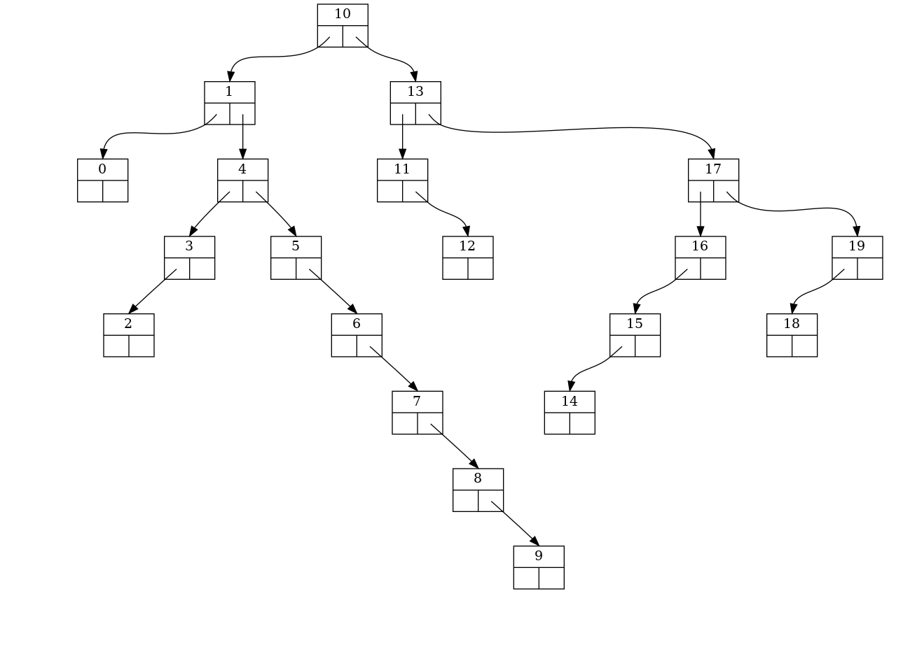
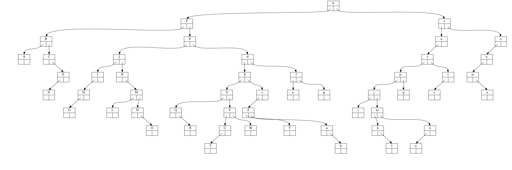

# abrviz

## usage

``` python
from abrviz import Arbre
import random
import string

liste = list(range(20))
random.shuffle(liste)

a = Arbre()
for i in liste:
    a.inserer(i)

a.sortie("test_1", "png")
print(f"liste de départ\n\t{a.liste_insertion}")
print(f"parcours préfixe\n\t{a.prefixe}")
print(f"parcours infixe\n\t{a.infixe}")
print(f"parcours suffixe\n\t{a.suffixe}")
print(f"Taille : {a.taille}\nHauteur : {a.hauteur}")

print()

liste = list(string.ascii_letters)
random.shuffle(liste)
b = Arbre()
for i in liste:
    b.inserer(i)
b.fonction_ordre = lambda x, y: str(x) < str(y)
b.sortie("test_2", "png")
print(f"liste de départ\n\t{b.liste_insertion}")
print(f"parcours préfixe\n\t{b.prefixe}")
print(f"parcours infixe\n\t{b.infixe}")
print(f"parcours suffixe\n\t{b.suffixe}")
print(f"Taille : {b.taille}\nHauteur : {b.hauteur}")

```

# Sortie image





# Sortie console

``` python
liste de départ
	[10, 1, 4, 5, 0, 6, 3, 13, 2, 17, 19, 16, 15, 7, 18, 11, 12, 8, 9, 14]
parcours préfixe
	[10, 1, 0, 4, 3, 2, 5, 6, 7, 8, 9, 13, 11, 12, 17, 16, 15, 14, 19, 18]
parcours infixe
	[0, 1, 2, 3, 4, 5, 6, 7, 8, 9, 10, 11, 12, 13, 14, 15, 16, 17, 18, 19]
parcours suffixe
	[0, 2, 3, 9, 8, 7, 6, 5, 4, 1, 12, 11, 14, 15, 16, 18, 19, 17, 13, 10]
Taille : 20
Hauteur : 8

liste de départ
	['h', 'F', 'v', 'P', 'u', 'd', 'f', 'r', 'p', 'J', 'K', 'X', 'S', 'j', 't', 'I', 'm', 'z', 'y', 'c', 'w', 's', 'k', 'l', 'V', 'B', 'Q', 'M', 'o', 'U', 'C', 'e', 'Z', 'n', 'q', 'W', 'i', 'g', 'L', 'H', 'R', 'E', 'Y', 'G', 'T', 'A', 'a', 'N', 'O', 'D', 'x', 'b']
parcours préfixe
	['h', 'F', 'B', 'A', 'C', 'E', 'D', 'P', 'J', 'I', 'H', 'G', 'K', 'M', 'L', 'N', 'O', 'd', 'X', 'S', 'Q', 'R', 'V', 'U', 'T', 'W', 'c', 'Z', 'Y', 'a', 'b', 'f', 'e', 'g', 'v', 'u', 'r', 'p', 'j', 'i', 'm', 'k', 'l', 'o', 'n', 'q', 't', 's', 'z', 'y', 'w', 'x']
parcours infixe
	['A', 'B', 'C', 'D', 'E', 'F', 'G', 'H', 'I', 'J', 'K', 'L', 'M', 'N', 'O', 'P', 'Q', 'R', 'S', 'T', 'U', 'V', 'W', 'X', 'Y', 'Z', 'a', 'b', 'c', 'd', 'e', 'f', 'g', 'h', 'i', 'j', 'k', 'l', 'm', 'n', 'o', 'p', 'q', 'r', 's', 't', 'u', 'v', 'w', 'x', 'y', 'z']
parcours suffixe
	['A', 'D', 'E', 'C', 'B', 'G', 'H', 'I', 'L', 'O', 'N', 'M', 'K', 'J', 'R', 'Q', 'T', 'U', 'W', 'V', 'S', 'Y', 'b', 'a', 'Z', 'c', 'X', 'e', 'g', 'f', 'd', 'P', 'F', 'i', 'l', 'k', 'n', 'o', 'm', 'j', 'q', 'p', 's', 't', 'r', 'u', 'x', 'w', 'y', 'z', 'v', 'h']
Taille : 52
Hauteur : 9
```

## Licence
CC-BY-NC-SA
