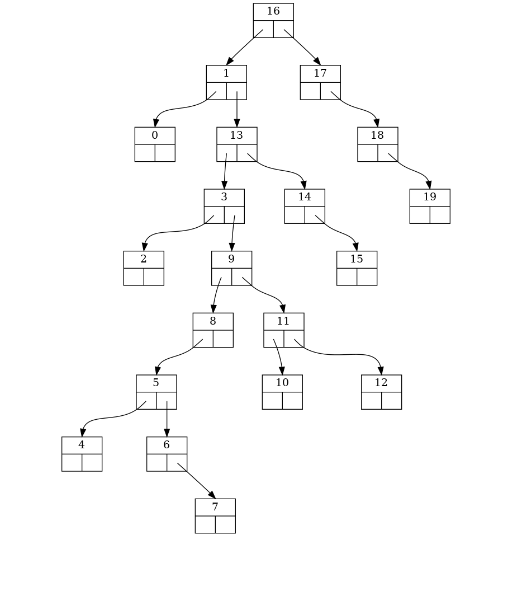

# abrviz

## usage

``` python
import random
    
    
liste = list(range(20))
random.shuffle(liste)

a = Arbre()
# a.set_fonction_ordre(lambda x, y: str(x) < str(y))

for i in liste:
    a.ajoute_noeud(i)

a.sortie("test", "png")
```

## Exemple de sortie image



## Licence
CC-BY-NC-SA
