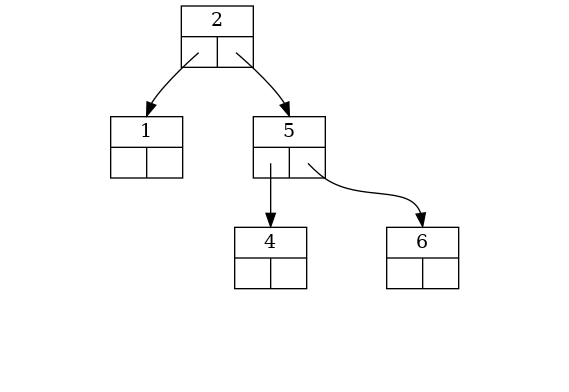
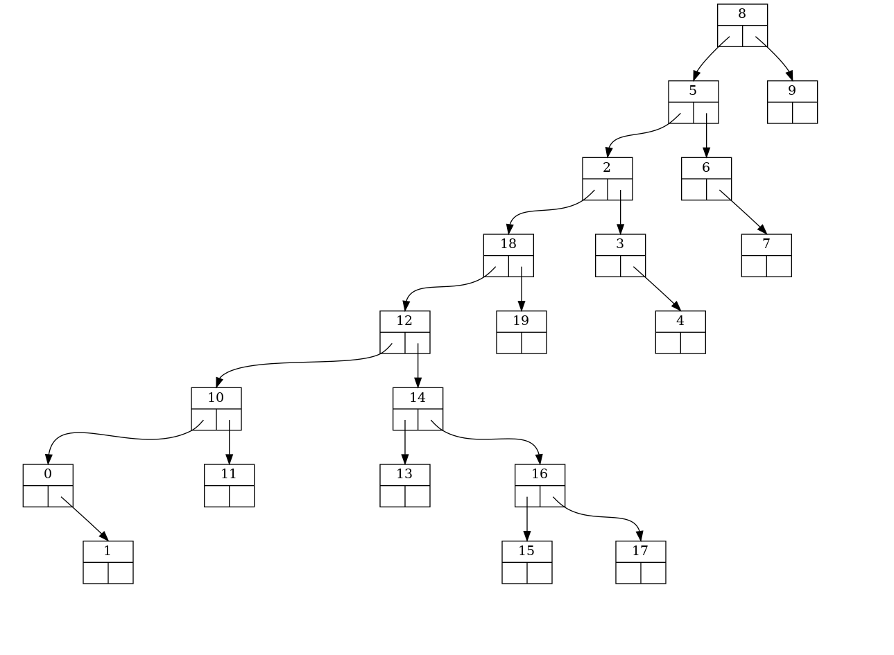
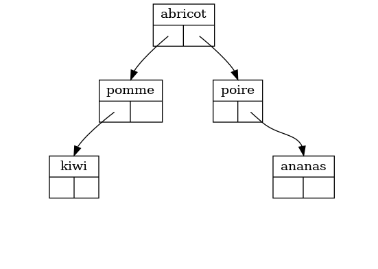
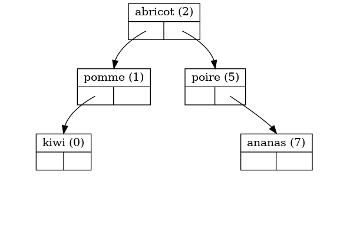

# abrviz

## Exemples

### Exemple 1

#### Code

``` python
from abrviz import Arbre, Noeud


a = Arbre()
liste = [Noeud(i) for i in [3, 2, 1, 5, 4, 6]]
liste_noeuds = []
for i in liste:
    liste_noeuds.append(a.inserer(i))


print(a)
Arbre.sortie(a.racine, "exemple1_0", "png")
print(a.prefixe, a.infixe, a.suffixe)
print(f"hauteur = {a.hauteur()}")

Arbre.sortie(liste_noeuds[1], "exemple1_1", "png")

a.supprimer(liste_noeuds[0])
Arbre.sortie(a.racine, "exemple1_2", "png")

```


#### Sortie console

``` python
$ python3 exemple.py
(((None -- 1 -- None) -- 2 -- None) -- 3 -- ((None -- 4 -- None) -- 5 -- (None -- 6 -- None)))
[3, 2, 1, 5, 4, 6] [1, 2, 3, 4, 5, 6] [1, 2, 4, 6, 5, 3]
hauteur = 3

```

#### Sortie images





### Exemple 2

#### Code

``` python
from abrviz import Arbre, Noeud
import random


liste = list(range(10))
random.shuffle(liste)
b = Arbre()
for e in liste:
    b.inserer(Noeud(e))

Arbre.sortie(b.racine, "exemple2_0", "png")
Arbre.sortie(b.racine.droit, "exemple2_1", "png")

```

#### Sortie images


### Exemple 3

#### Code

``` python
from abrviz import Arbre, Noeud

# EXEMPLE 3
import random
liste = list(range(20))
random.shuffle(liste)
c = Arbre()
c.fonction_ordre = lambda x, y: str(x.valeur) < str(y.valeur)
for e in liste:
    c.inserer(Noeud(e))

Arbre.sortie(c.racine, "exemple3_0", "png")

```

#### Sortie image




### Exemple 4

#### Code

``` python
from abrviz import Arbre, Noeud

d = {"abricot": 2, "poire": 5, "pomme": 1, "ananas": 7, "kiwi": 0}

c = Arbre()
for k in d:
    c.inserer(Noeud(d[k], k))
Arbre.etiquette = "contenu"
Arbre.sortie(c.racine, "exemple4_0", "png")

c = Arbre()
for k in d:
    noeud = Noeud(d[k])
    noeud.contenu = f"{k} ({d[k]})"
    c.inserer(noeud)

Arbre.etiquette = "contenu"
Arbre.sortie(c.racine, "exemple4_1", "png")

```

#### Sortie images





## Licence
CC-BY-NC-SA
