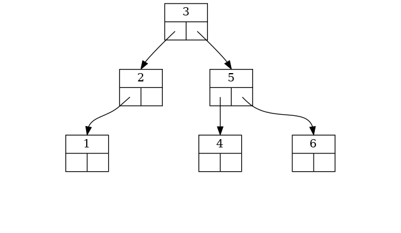
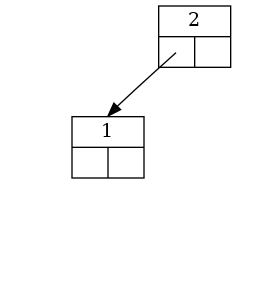
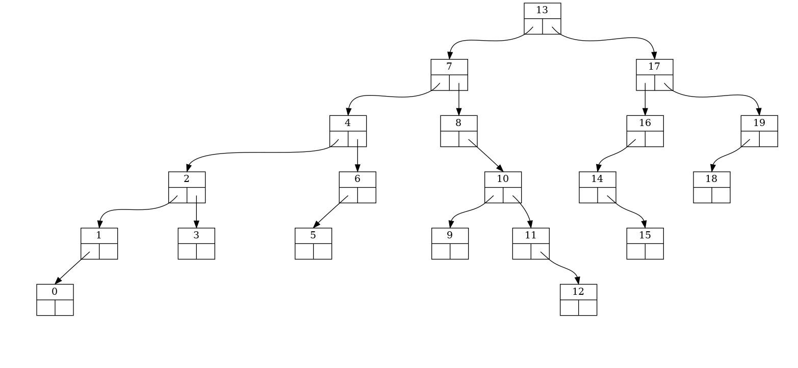
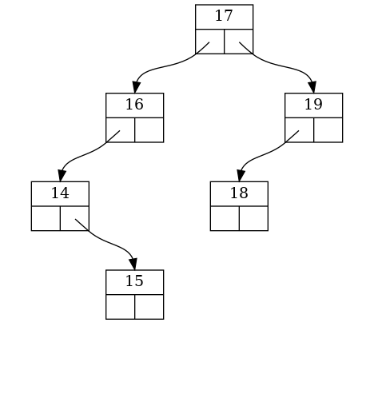

# abrviz

## usage

``` python
from abrviz import Arbre, Noeud

# EXEMPLE 1
a = Arbre()
liste = [Noeud(i) for i in [3, 2, 1, 5, 4, 6]]
liste_noeuds = []
for i in liste:
    liste_noeuds.append(a.inserer(i))


print(a)
Arbre.sortie(a.racine, "exemple1_0", "png")
print(a.prefixe, a.infixe, a.suffixe)
print(a.hauteur())

Arbre.sortie(liste_noeuds[2], "exemple1_1", "png")

a.supprimer(liste_noeuds[0])
Arbre.sortie(a.racine, "exemple1_2", "png")

# EXEMPLE 2
import random
liste = list(range(20))
random.shuffle(liste)
b = Arbre()
for e in liste:
    b.inserer(Noeud(e))

Arbre.sortie(b.racine, "exemple2_0", "png")
Arbre.sortie(b.racine.droit, "exemple2_1", "png")

```


# Sortie console

``` python
$ python3 exemple.py
(((None -- 1 -- None) -- 2 -- None) -- 3 -- ((None -- 4 -- None) -- 5 -- (None -- 6 -- None)))
[3, 2, 1, 5, 4, 6] [1, 2, 3, 4, 5, 6] [1, 2, 4, 6, 5, 3]
3

```

# Sortie image

## Exemple 1





## Exemple 2





## Licence
CC-BY-NC-SA
