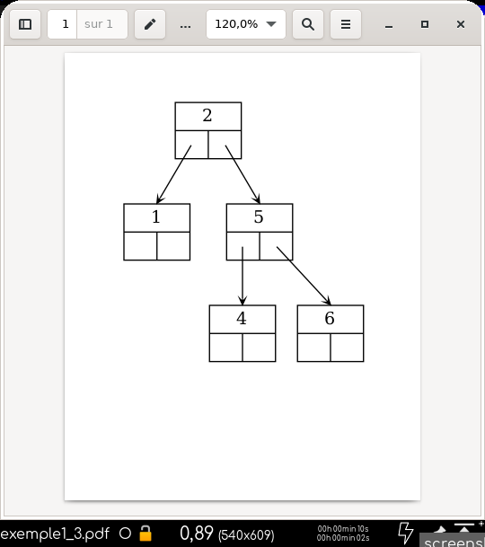

# abrviz

## Installation

`pip3 install abrviz`

## Exemple 0

### Code
```python
from abrviz import Arbre, Noeud


valeurs = [3, 4, 7, 9, 5, 8, 1, 0, 6, 2]
noeuds = [Noeud(i) for i in valeurs]

a = Arbre()
for n in noeuds:
    a.inserer(n)

texte = f"""Affichage imbriquée :
{a}

Hauteur : {a.hauteur()}
Taille : {len(a)}

Les parcours fournissent des listes d'objets :
Parcours en largeur : {a.largeur}

Pour obtenir les clés, on demande les valeurs :
Parcours en largeur : {[n.valeur for n in a.largeur]}

Parcours prefixe : {[n.valeur for n in a.prefixe]}
Parcours infixe : {[n.valeur for n in a.infixe]}
Parcours suffixe : {[n.valeur for n in a.suffixe]}

Une liste 'complète' en largeur peut être obtenue :
{[n if not n else n.valeur for n in a.liste_aplatie()]}

Recherche du noeud de clé 5 :
le noeud : {a.rechercher(5).__repr__()}
son arborescence : {a.rechercher(5)}
sa valeur : {a.rechercher(5).valeur}
son contenu (éventuellement transporté dans sa structure) : \
{a.rechercher(5).contenu}
le chemin qui y mène : {[n.valeur for n in a.chemin_vers(a.rechercher(5))]}

Si on connaît une référence vers le noeud, on peut l'utiliser.
le noeud de clé 5 est le 4ème de la liste noeuds : \
{noeuds[4]}
"""
print(texte)

a.supprimer(noeuds[0])
texte = f"""Nouveau parcours en largeur après suppression de la racine :
{[n.valeur for n in a.largeur]}
"""
print(texte)

```

### Sortie console

```python
Affichage imbriquée :
(((None -- 0 -- None) -- 1 -- (None -- 2 -- None)) -- 3 -- (None -- 4 -- ((None -- 5 -- (None -- 6 -- None)) -- 7 -- ((None -- 8 -- None) -- 9 -- None))))

Hauteur : 5
Taille : 10

Les parcours fournissent des listes d'objets :
Parcours en largeur : [<abrviz.abrviz.Noeud object at 0x7fec0c283eb0>, <abrviz.abrviz.Noeud object at 0x7fec0c283880>, <abrviz.abrviz.Noeud object at 0x7fec0c283f10>, <abrviz.abrviz.Noeud object at 0x7fec0c38c0d0>, <abrviz.abrviz.Noeud object at 0x7fec0c14da90>, <abrviz.abrviz.Noeud object at 0x7fec0c283f40>, <abrviz.abrviz.Noeud object at 0x7fec0c283fa0>, <abrviz.abrviz.Noeud object at 0x7fec0c283d30>, <abrviz.abrviz.Noeud object at 0x7fec0c14d760>, <abrviz.abrviz.Noeud object at 0x7fec0c283c70>]

Pour obtenir les clés, on demande les valeurs :
Parcours en largeur : [3, 1, 4, 0, 2, 7, 5, 9, 6, 8]

Parcours prefixe : [3, 1, 0, 2, 4, 7, 5, 6, 9, 8]
Parcours infixe : [0, 1, 2, 3, 4, 5, 6, 7, 8, 9]
Parcours suffixe : [0, 2, 1, 6, 5, 8, 9, 7, 4, 3]

Une liste 'complète' en largeur peut être obtenue :
[3, 1, 4, 0, 2, None, 7, None, None, None, None, None, None, 5, 9, None, None, None, None, None, None, None, None, None, None, None, None, None, 6, 8]

Recherche du noeud de clé 5 :
le noeud : <abrviz.abrviz.Noeud object at 0x7fec0c283fa0>
son arborescence : (None -- 5 -- (None -- 6 -- None))
sa valeur : 5
son contenu (éventuellement transporté dans sa structure) : None
le chemin qui y mène : [3, 4, 7, 5]

Si on connaît une référence vers le noeud, on peut l'utiliser.
le noeud de clé 5 est le 4ème de la liste noeuds : (None -- 5 -- (None -- 6 -- None))

Nouveau parcours en largeur après suppression de la racine :
[2, 1, 4, 0, 7, 5, 9, 6, 8]

```

## Exemple 1

### Code
```python
from abrviz import Arbre, Noeud


a = Arbre()
liste = [Noeud(i) for i in [3, 2, 1, 5, 4, 6]]
for i in liste:
    a.inserer(i)

# on visualise l'arbre
a.sortie(a.racine, "exemple1_0", "png")
# on demande une visualisation en arbre binaire complet : un peu
# plus d'espace dans la dernière ligne
a.sortie(a.racine, "exemple1_1", "png", style="complet")
# on demande une visualisation à partir du 2ème noeud rentré
a.sortie(liste[1], "exemple1_2", "png")
# on supprime la racine puis on visualise le nouvel arbre en pdf
a.supprimer(liste[0])
a.sortie(a.racine, "exemple1_3", "pdf")

```

### Sortie Images





## Exemple 2

### Code
```python
from abrviz import Arbre, Noeud
import random


liste = list(range(15))
random.shuffle(liste)

a = Arbre()
for e in liste:
    a.inserer(Noeud(e))

# Visualisation de l'arbre
mon_noeud = a.racine
a.sortie(mon_noeud, "exemple2_0", "png")

# on peut demander une version "complète" avec les noeuds
# invisibles d'un arbre binaire complet : l'apparence est très
# large
a.sortie(mon_noeud, "exemple2_1", "png", style="complet")

# s'il y a un sous-arbre gauche, on le visualise
if mon_noeud.gauche is not None:
    a.sortie(mon_noeud.gauche, "exemple2_2", "png")

```

### Sortie Images


## Exemple 3

### Code
```python
from abrviz import Arbre, Noeud
import random


liste = list(range(20))
random.shuffle(liste)

a = Arbre()
# on change la fonction de la relation d'ordre
a.fonction_ordre = lambda x, y: str(x.valeur) < str(y.valeur)

for e in liste:
    a.inserer(Noeud(e))

a.sortie(a.racine, "exemple3_0", "png")

# on change le style
Arbre.options('node', {"style": "filled"})
Arbre.options('edge', {"arrowhead": "diamond", "arrowsize": "1"})
a.sortie(a.racine, "exemple3_1", "png")

# les flèches se courbent
Arbre.options('graph', {"splines": "true"})
a.sortie(a.racine, "exemple3_2", "png")

```

### Sortie Images


## Exemple 4

### Code
```python
from abrviz import Arbre, Noeud

# dictionnaire, les valeurs seront les clés de l'arbre
dico_contenu = {"abricot": 2, "poire": 5, "pomme": 1, "ananas": 7, "kiwi": 0}

a = Arbre()
for k in dico_contenu:
    a.inserer(Noeud(dico_contenu[k], k))

# les noeuds montreront le contenu du noeud et non la clé ("valeur")
Arbre.etiquette = "contenu"
a.sortie(a.racine, "exemple4_0", "png")

# pour visualiser un mix des deux (clés et valeurs du dictionnaire)
# on redéfinit l'arbre et les noeuds :
a = Arbre()
for k in dico_contenu:
    noeud = Noeud(dico_contenu[k])
    # le contenu du noeud reprend les données complètes du dictionnaire
    noeud.contenu = f"{k} ({dico_contenu[k]})"
    a.inserer(noeud)

Arbre.etiquette = "contenu"
a.sortie(a.racine, "exemple4_1", "png")

```

### Sortie Images


## Exemple 5

### Code
```python
from abrviz import Arbre, Noeud


liste = [2, 3, 6, 0, 4, 5, 1]
liste_noeuds = [Noeud(i) for i in liste]

a = Arbre()
for e in liste_noeuds:
    a.inserer(e)

# On peut effectuer des mouvements de rotation à droite ou à gauche
# L'arbre reste un ABR
a.sortie(a.racine, "exemple5_0", "png")

# le noeud "racine" du changement est passé en argument
a.rotation_gauche(a.rechercher(2))
a.sortie(a.racine, "exemple5_1", "png")

# on peut alors équilibrer l'arbre
a.rotation_gauche(a.rechercher(0))
a.rotation_droite(a.rechercher(2))
a.rotation_gauche(a.rechercher(4))
a.rotation_droite(a.rechercher(6))
a.sortie(a.racine, "exemple5_2", "png")

```

### Sortie Images


## Licence
CC-BY-NC-SA
