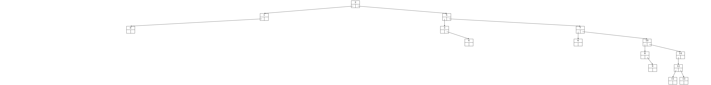

# abrviz

## Installation

`pip3 install abrviz`

## Exemple 0

### Code
```python
from abrviz import Arbre, Noeud


valeurs = [3, 4, 7, 9, 5, 8, 1, 0, 6, 2]
noeuds = [Noeud(i) for i in valeurs]

a = Arbre()
for n in noeuds:
    a.inserer(n)

print("Affichage imbriquée :")
print(a)
print()
print("Hauteur :", a.hauteur())
print("Taille :", len(a))
print()
print("Parcours en largeur :", a.largeur)
print("Parcours prefixe :", a.prefixe)
print("Parcours infixe :", a.infixe)
print("Parcours suffixe :", a.suffixe)
print("Liste aplatie en largeur :", a.liste_aplatie())
print()
a.supprimer(noeuds[0])
print("Nouveau parcours en largeur après suppression du noeud racine :")
print(a.largeur)

```

### Sortie console

```python
Affichage imbriquée :
(((None -- 0 -- None) -- 1 -- (None -- 2 -- None)) -- 3 -- (None -- 4 -- ((None -- 5 -- (None -- 6 -- None)) -- 7 -- ((None -- 8 -- None) -- 9 -- None))))

Hauteur : 5
Taille : 10

Parcours en largeur : [3, 1, 4, 0, 2, 7, 5, 9, 6, 8]
Parcours prefixe : [3, 1, 0, 2, 4, 7, 5, 6, 9, 8]
Parcours infixe : [0, 1, 2, 3, 4, 5, 6, 7, 8, 9]
Parcours suffixe : [0, 2, 1, 6, 5, 8, 9, 7, 4, 3]
Liste aplatie en largeur : [3, 1, 4, 0, 2, None, 7, None, None, None, None, None, None, 5, 9, None, None, None, None, None, None, None, None, None, None, None, None, None, 6, 8]

Nouveau parcours en largeur après suppression du noeud racine :
[2, 1, 4, 0, 7, 5, 9, 6, 8]
```

## Exemple 1

### Code
```python
from abrviz import Arbre, Noeud


a = Arbre()
liste = [Noeud(i) for i in [3, 2, 1, 5, 4, 6]]
for i in liste:
    a.inserer(i)


Arbre.sortie(a.racine, "exemple1_0", "png")
Arbre.sortie(liste[1], "exemple1_1", "png")
a.supprimer(liste[0])
Arbre.sortie(a.racine, "exemple1_2", "png")

```

### Sortie Images


## Exemple 2

### Code
```python
from abrviz import Arbre, Noeud
import random


liste = list(range(15))
random.shuffle(liste)

a = Arbre()
for e in liste:
    a.inserer(Noeud(e))

mon_noeud = a.racine
Arbre.sortie(mon_noeud, "exemple2_0", "png")
Arbre.sortie(mon_noeud.droit, "exemple2_1", "png")

if mon_noeud.gauche is not None:
    mon_noeud = mon_noeud.gauche
    Arbre.sortie(mon_noeud, "exemple2_2", "png")

```

### Sortie Images



## Exemple 3

### Code
```python
from abrviz import Arbre, Noeud
import random


liste = list(range(20))
random.shuffle(liste)

a = Arbre()
a.fonction_ordre = lambda x, y: str(x.valeur) < str(y.valeur)

for e in liste:
    a.inserer(Noeud(e))

Arbre.sortie(a.racine, "exemple3_0", "png")

Arbre.options('node', {"style": "filled"})
Arbre.options('edge', {"arrowhead": "vee", "arrowsize": ".5"})
Arbre.sortie(a.racine, "exemple3_1", "png")

Arbre.options('graph', {"splines": "false"})
Arbre.sortie(a.racine, "exemple3_2", "png")

```

### Sortie Images


## Exemple 4

### Code
```python
from abrviz import Arbre, Noeud

dico_contenu = {"abricot": 2, "poire": 5, "pomme": 1, "ananas": 7, "kiwi": 0}

a = Arbre()
for k in dico_contenu:
    a.inserer(Noeud(dico_contenu[k], k))
Arbre.etiquette = "contenu"
Arbre.sortie(a.racine, "exemple4_0", "png")

a = Arbre()
for k in dico_contenu:
    noeud = Noeud(dico_contenu[k])
    noeud.contenu = f"{k} ({dico_contenu[k]})"
    a.inserer(noeud)

Arbre.etiquette = "contenu"
Arbre.sortie(a.racine, "exemple4_1", "png")

```

### Sortie Images


## Licence
CC-BY-NC-SA